# 🏆 FIFA 2026 World Cup Prediction


> A statistical machine learning pipeline for predicting the 2026 FIFA World Cup winner using Poisson regression, Monte Carlo simulation, and cloud-native data infrastructure provisioned with Terraform.

---

## 📋 Table of Contents

- [Overview](#overview)
- [Architecture](#architecture)
- [Repository Structure](#repository-structure)
- [Data](#data)
- [Methods](#methods)
- [Results](#results)
- [Infrastructure Setup](#infrastructure-setup)
- [How to Run](#how-to-run)
- [Limitations & Future Work](#limitations--future-work)
- [References](#references)

---

## Overview

This project builds a full end-to-end prediction pipeline for the **2026 FIFA World Cup** (hosted by USA, Canada, and Mexico). Unlike classification-based approaches that predict Win/Draw/Loss directly, this project models goals as a **Poisson process** — a statistically principled approach for count data — and simulates the full 48-team tournament bracket using **500 Monte Carlo runs**.

**Key questions addressed:**
- Which national teams have the strongest attacking squads based on European league data?
- What is the expected scoreline for any given matchup between 2026 qualifiers?
- Which team is most likely to win the 2026 World Cup?

---

## Architecture

```
┌─────────────────────────────────────────────────────────────┐
│                    DATA LAYER                               │
│  Google Cloud Storage Bucket (Terraform-provisioned)        │
│  ┌─────────────────┐    ┌──────────────────────────────┐   │
│  │  player_data    │    │  major_int_tournaments.csv   │   │
│  │  .csv           │    │  (Match results 2019–2025)   │   │
│  └─────────────────┘    └──────────────────────────────┘   │
└─────────────────────────────┬───────────────────────────────┘
                              │ ETL Pipeline (GCS → R)
                              ▼
┌─────────────────────────────────────────────────────────────┐
│                  PROCESSING LAYER                           │
│  00_etl_pipeline.R  →  01_data_prep.R  →  02_eda.R         │
│  03_feature_engineering.R                                   │
│  • Minutes-weighted squad aggregation                       │
│  • Differential feature construction                        │
│  • Time-based train/test split                             │
└─────────────────────────────┬───────────────────────────────┘
                              │
                              ▼
┌─────────────────────────────────────────────────────────────┐
│                   MODELING LAYER                            │
│  04_poisson_model.R                                         │
│  • Bivariate Poisson Regression                            │
│  • Rolling Time-Series Cross-Validation (5 folds)          │
│  • Overdispersion check (NB fallback)                       │
│  • Score matrix: P(scoreline) for any matchup              │
└─────────────────────────────┬───────────────────────────────┘
                              │
                              ▼
┌─────────────────────────────────────────────────────────────┐
│                  SIMULATION LAYER                           │
│  05_simulation.R  →  06_visualizations.R                   │
│  • Full 48-team group stage simulation                     │
│  • Single-elimination knockout bracket                     │
│  • Extra time + penalty shootout logic                     │
│  • 500 Monte Carlo runs → champion probabilities           │
└─────────────────────────────────────────────────────────────┘
```

---

## Repository Structure

```
FIFA-2026/
├── .github/
│   └── workflows/
│       └── etl_pipeline.yml        # CI/CD placeholder (GH Actions)
├── infrastructure/
│   ├── main.tf                     # GCS bucket + IAM provisioning
│   ├── variables.tf
│   ├── outputs.tf
│   └── terraform.tfvars.example    # Template — never commit real values
├── data/
│   ├── player_data.csv             # Player stats from top 5 European leagues
│   └── major_int_tournaments.csv   # International match results 2019–2025
├── src/
│   ├── 00_etl_pipeline.R           # GCS pull with local fallback + validation
│   ├── 01_data_prep.R              # Cleaning, normalization, team filtering
│   ├── 02_eda.R                    # EDA: distributions, correlations, PCA
│   ├── 03_feature_engineering.R    # Squad features, differentials, splits
│   ├── 04_poisson_model.R          # Poisson regression + rolling CV
│   ├── 05_simulation.R             # Monte Carlo tournament simulation
│   └── 06_visualizations.R        # Final figures and results summary
├── docs/
│   ├── report.md                   # Full project report
│   └── figures/                    # All generated visualizations
├── .gitignore
└── README.md
```

---

## Data

| Dataset | Description | Records | Source |
|---|---|---|---|
| `player_data.csv` | Player stats (xG, xA, xG Chain, Key Passes, minutes) from Europe's Top 5 Leagues | 8,210 players | Understat / StatsBomb |
| `major_int_tournaments.csv` | International match results 2019–2025 across 14 competitions | 511 matches | football-data.co.uk / Kaggle |

**Data storage:** Both datasets are stored in a Google Cloud Storage bucket (`wc2026-prediction-data-elkinhuertas`) provisioned via Terraform. The `data/` folder serves as a local fallback for running scripts without GCS credentials.

### Key Variable Definitions

| Variable | Definition | Source |
|---|---|---|
| xG | Expected Goals — probability a shot results in a goal based on location, angle, and shot type | Understat |
| xA | Expected Assists — xG value of the shot that was assisted | Understat |
| xG Chain | xG from all possessions a player is involved in | Understat |
| xG Buildup | xG from possessions excluding the shot and assist | Understat |
| Key Passes | Passes that directly lead to a shot on goal | Understat |
| ELO Rating | Team strength rating updated after each match using the Elo system (Elo, 1978) | Club Elo |
| Minutes | Total minutes played — used as aggregation weight | Understat |

---

## Methods

### Feature Engineering
Player stats are aggregated to the national team level using **minutes-weighted averages** across the top 15 players by playing time. This gives more weight to players who actually feature regularly, producing more reliable squad-level estimates than a simple top-11 slice.

A **squad depth index** is also computed — measuring how evenly goal contribution is distributed across the squad rather than concentrated in one star player.

### Poisson Regression Model
Goals scored by each team are modeled as:

```
Goals_i ~ Poisson(λ_i)
log(λ_i) = β₀ + β₁·xG + β₂·xA + β₃·xG_chain + β₄·opp_xG + β₅·depth + β₆·is_home
```

This produces an **expected goals (λ)** for each team in any matchup, from which the full scoreline probability matrix is derived using the Poisson PMF.

### Rolling Cross-Validation
A **5-fold rolling time-series CV** is used — each fold trains on all historical data up to a cutoff date and validates on the next window. This prevents data leakage that would occur with random k-fold CV on temporal data.

### Monte Carlo Tournament Simulation
The full 2026 bracket (12 groups of 4, knockout from Round of 32) is simulated 500 times. Each match samples a scoreline from the Poisson score matrix. Knockout draws trigger extra time and penalty shootout logic.

---

## Results

### Exploratory Data Analysis

**Match outcome distribution (2021–2025):**

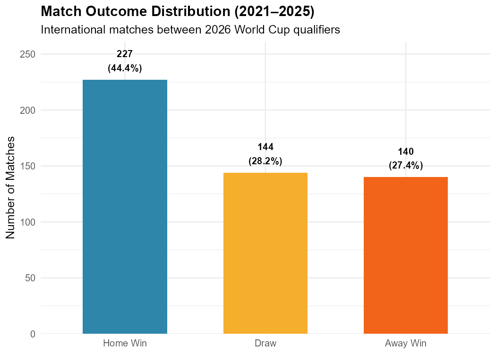

**Goals distributions:**

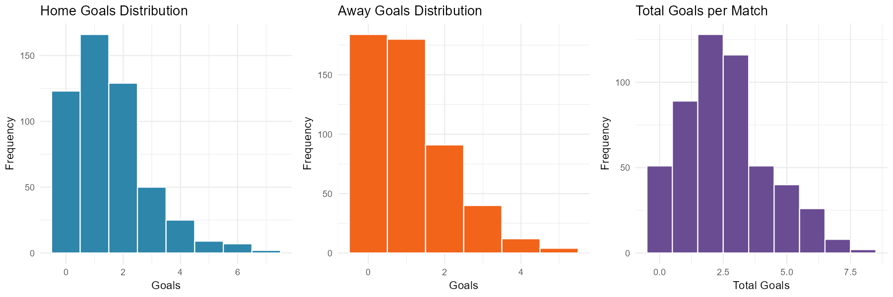

**Top nations by squad xG per 90:**

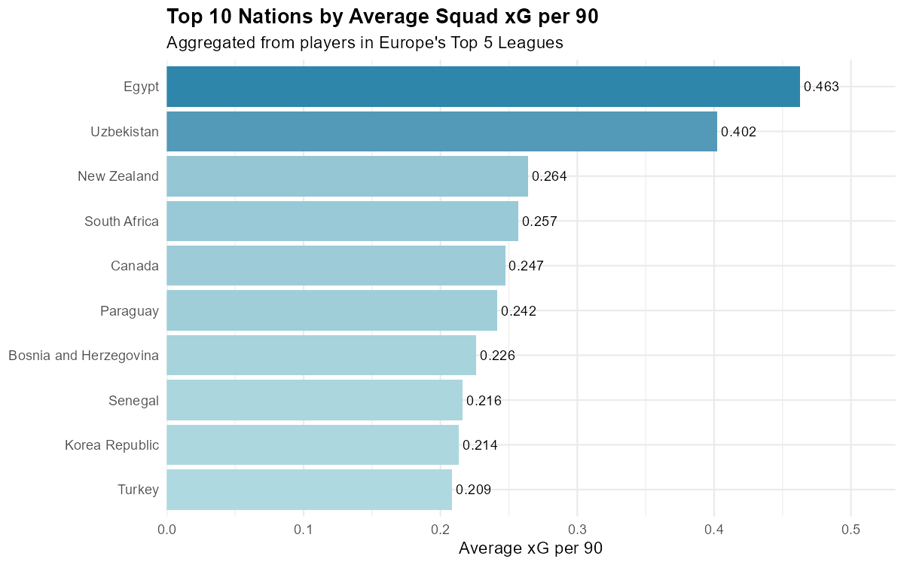

**Player metrics by position:**

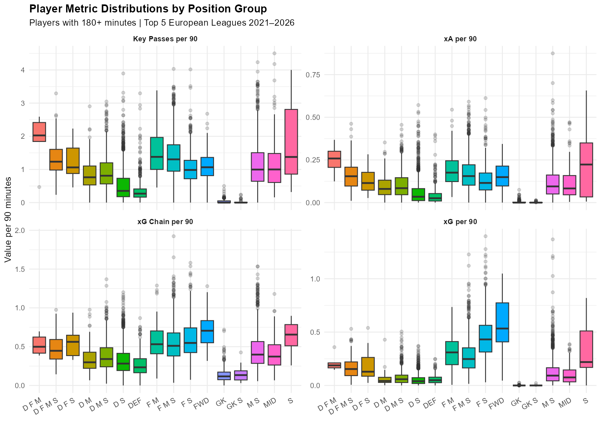

**Correlation matrix of player metrics:**

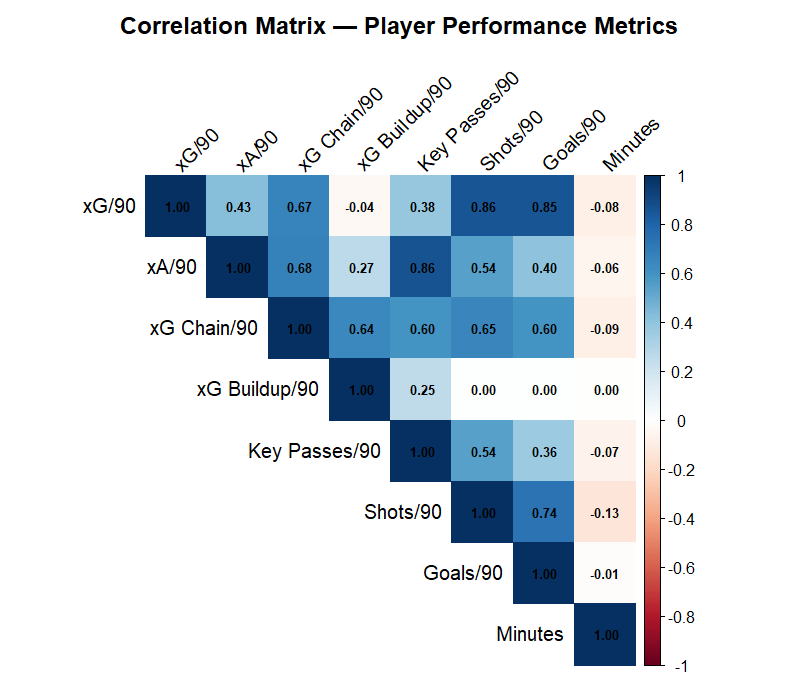

**PCA variable loadings:**

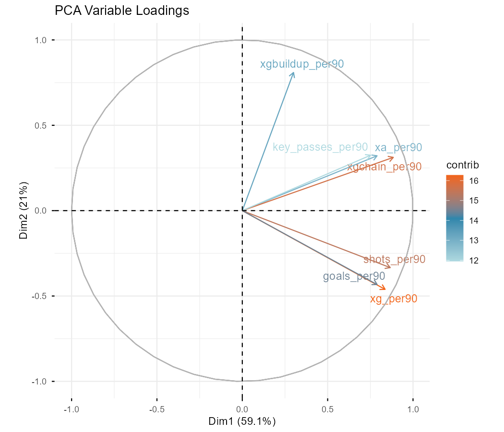

---

### Model Performance

| Model | Type | CV Method | MAE | RMSE | Accuracy |
|---|---|---|---|---|---|
| Logistic Regression | Classification | LASSO CV | — | — | 48.9% |
| SVM (Linear) | Classification | Grid CV | — | — | 47.3% |
| Random Forest | Classification | MC Sim | — | — | 58.2% |
| XGBoost | Classification | MC Sim | — | — | 56.4% |
| **Poisson Regression** | **Goal Model** | **Rolling CV** | **0.892** | **1.208** | **—** |

> The Poisson model is not directly comparable to classifiers on accuracy since it predicts scorelines rather than outcomes. Its MAE of 0.892 goals indicates predictions are within ~1 goal of actual on the test set.

**Predicted vs Actual Goals:**

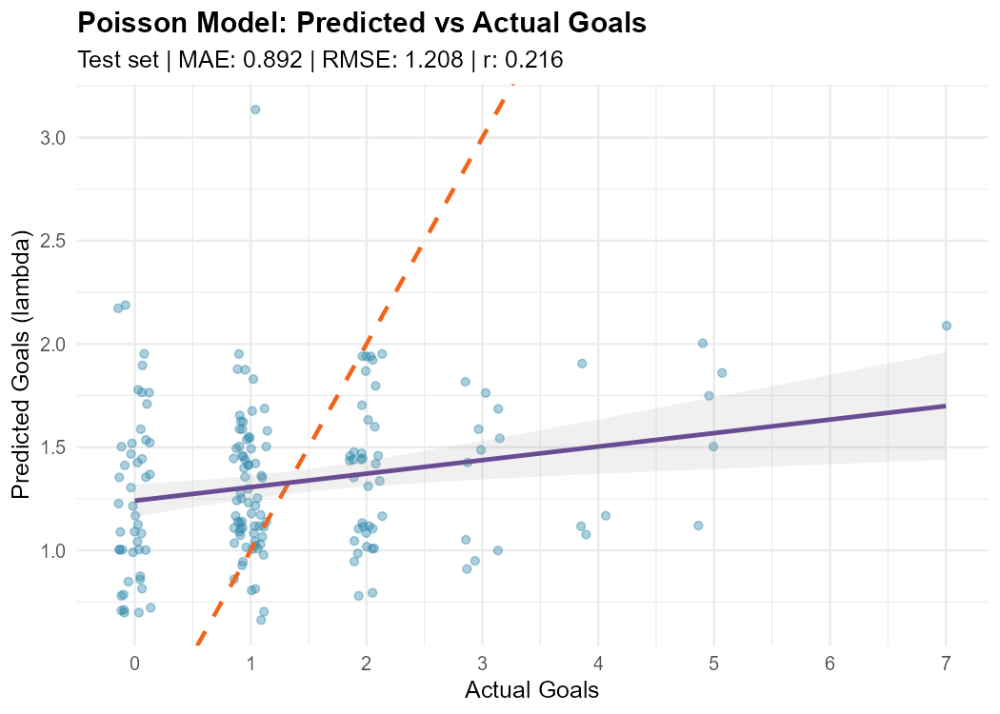

**Rolling CV Performance:**

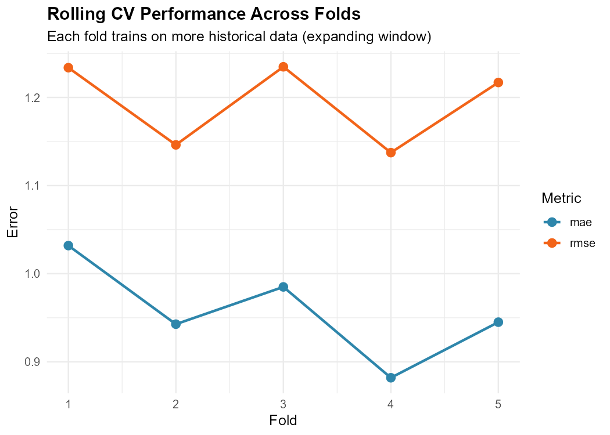

---

### Tournament Simulation Results

**Squad strength heatmap — all 48 nations:**

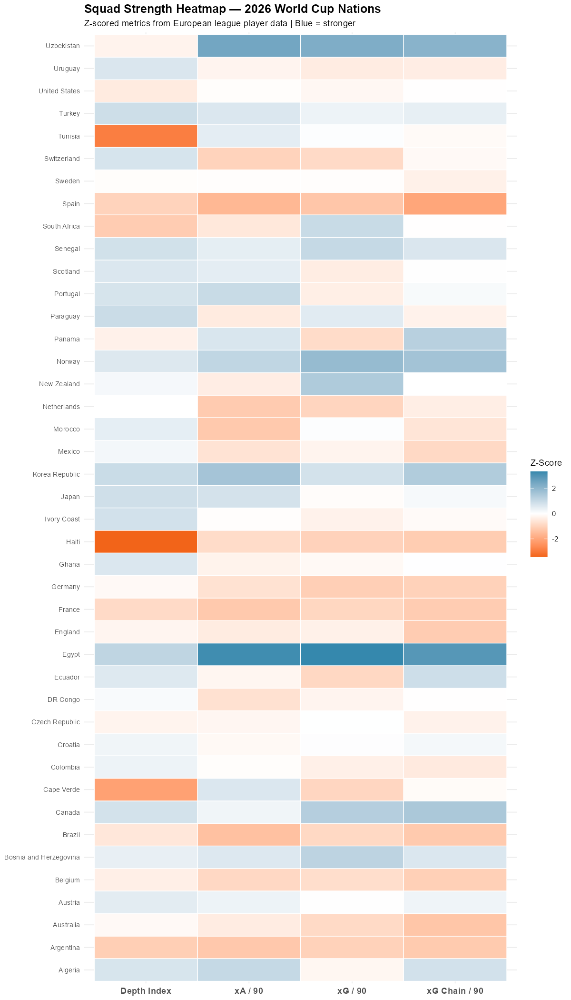

**Head-to-head win probability matrix — top 8 contenders:**

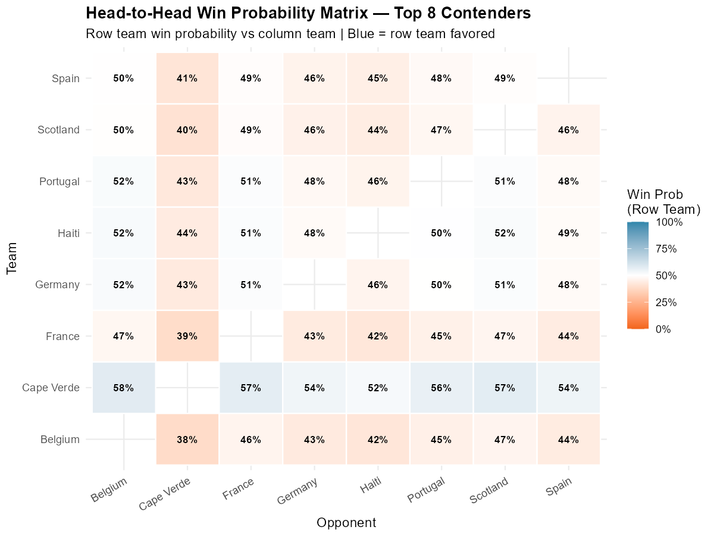

**Tournament progression funnel:**

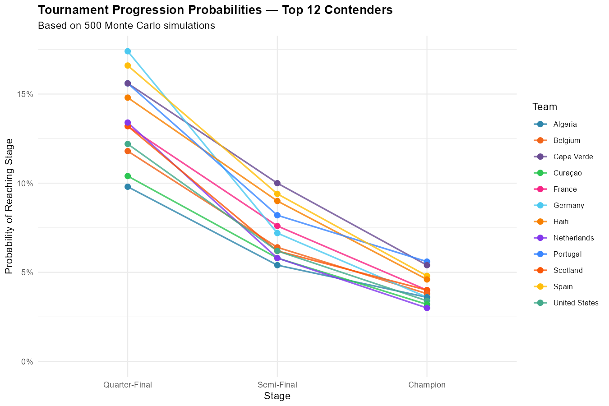

**Predicted champion probabilities (500 Monte Carlo simulations):**

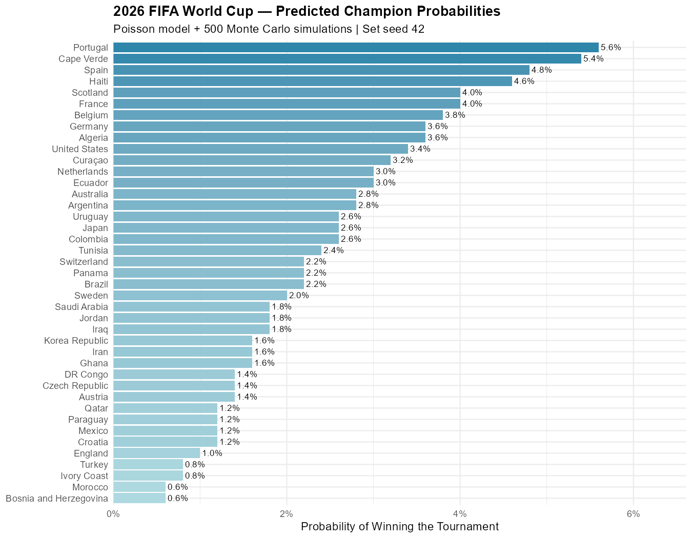

---

## Infrastructure Setup

The data layer is provisioned using Terraform on Google Cloud Platform.

### Prerequisites
- [Terraform >= 1.3.0](https://developer.hashicorp.com/terraform/install)
- [Google Cloud SDK](https://cloud.google.com/sdk/docs/install)
- A GCP project with Cloud Storage API enabled

### Provision Infrastructure

```bash
# Authenticate with GCP
gcloud auth application-default login

# Navigate to infrastructure folder
cd infrastructure

# Copy and fill in your values
cp terraform.tfvars.example terraform.tfvars

# Provision GCS bucket
terraform init
terraform plan
terraform apply
```

### Upload Data to GCS

```bash
gsutil cp data/player_data.csv gs://your-bucket-name/
gsutil cp data/major_int_tournaments.csv gs://your-bucket-name/
```

---

## How to Run

### Prerequisites
- R 4.5.x
- R packages: `tidyverse`, `ggplot2`, `corrplot`, `FactoMineR`, `factoextra`, `gridExtra`, `scales`, `ggtext`, `ggrepel`, `caret`, `glmnet`, `MASS`, `googleCloudStorageR`

### Install Packages

```r
install.packages(c(
  "tidyverse", "ggplot2", "corrplot", "FactoMineR", "factoextra",
  "gridExtra", "scales", "ggtext", "ggrepel", "caret", "glmnet",
  "MASS", "googleCloudStorageR"
))
```

### Run Pipeline

```r
setwd("path/to/FIFA-2026/src")

source("00_etl_pipeline.R")       # Load data from GCS or local
source("01_data_prep.R")          # Clean and filter
source("02_eda.R")                # Generate EDA figures
source("03_feature_engineering.R") # Build features and splits
source("04_poisson_model.R")      # Fit model and evaluate
source("05_simulation.R")         # Run tournament simulation
source("06_visualizations.R")     # Generate final figures
```

> **Note:** To run in local mode without GCS credentials, set `FORCE_LOCAL <- TRUE` in `00_etl_pipeline.R`.

---

## Limitations & Future Work

### Limitations
- **Missing squad data:** Teams with no representation in Europe's top 5 leagues (Iran, Jordan, Qatar, Saudi Arabia, Curaçao, Iraq, Cape Verde, Haiti) cannot be assigned player-level features. These teams default to equal match probabilities in the simulation, artificially inflating their championship likelihood. This explains anomalous results such as Cape Verde and Haiti appearing in the top 5 predicted champions.
- **No ELO integration:** The current model relies solely on player-level stats from European leagues. Teams that compete primarily outside Europe are underrepresented.
- **Static squad snapshot:** Player features reflect the most recent season and do not account for injuries, suspensions, or form going into the tournament.

### Future Work
- **ELO/FIFA ranking fallback:** Replace equal-probability assumptions for data-sparse teams with FIFA ranking points or ELO ratings as a baseline strength metric.
- **Proper bracket seeding:** Implement the official 2026 bracket seeding rules (group winners vs. third-place teams) instead of random knockout draws.
- **Injury and form weighting:** Incorporate rolling form windows and injury reports closer to the tournament start date.
- **GitHub Actions CI/CD:** Wire up the `.github/workflows/etl_pipeline.yml` placeholder to automatically pull fresh data from GCS and rerun the pipeline on a schedule.

---

## References

1. Maher, M.J. (1982). *Modelling association football scores*. Statistica Neerlandica, 36(3), 109–118.
2. Elo, A.E. (1978). *The Rating of Chessplayers, Past and Present*. Arpad Elo.
3. Dixon, M., & Coles, S. (1997). *Modelling association football scores and inefficiencies in the football betting market*. Journal of the Royal Statistical Society, 46(2), 265–280.
4. Karlis, D., & Ntzoufras, I. (2003). *Analysis of sports data by using bivariate Poisson models*. Journal of the Royal Statistical Society, 52(3), 381–393.
5. Understat. (2025). *Expected goals data for European football leagues*. https://understat.com
6. football-data.co.uk. (2025). *International football results dataset*. https://www.football-data.co.uk
7. Transfermarkt. (2025). *Player market values and international caps*. https://www.transfermarkt.com
8. StatsBomb. (2025). *Open data and metrics definitions*. https://statsbomb.com/what-we-do/hub/free-data/

---

*Project by Elkin Huertas | University of Miami — Data Science M.S. | 2026*